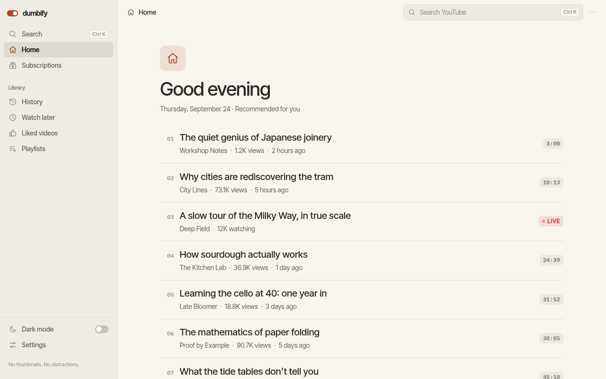
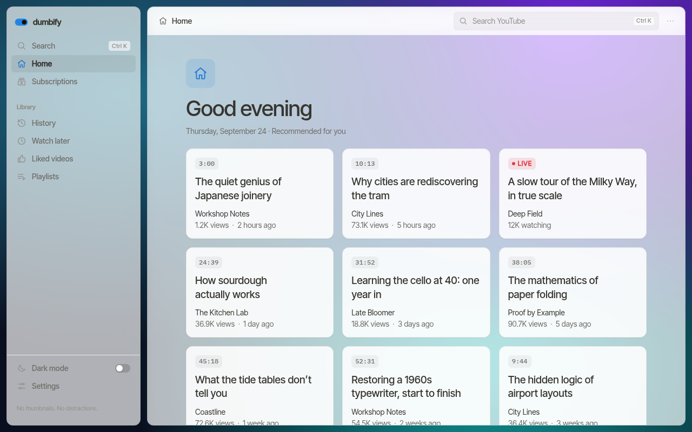
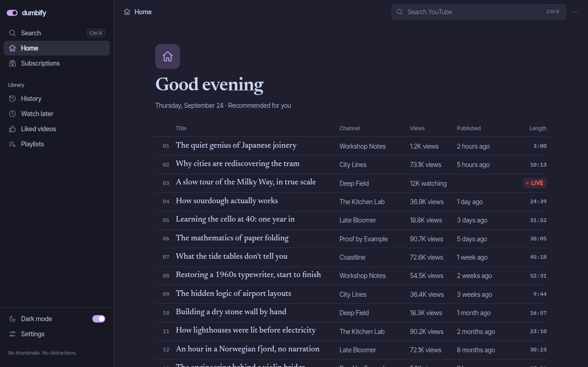
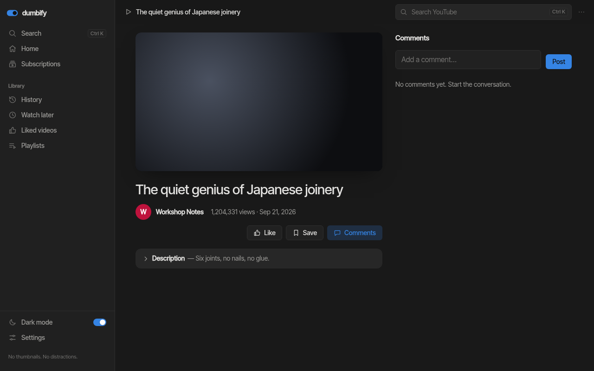
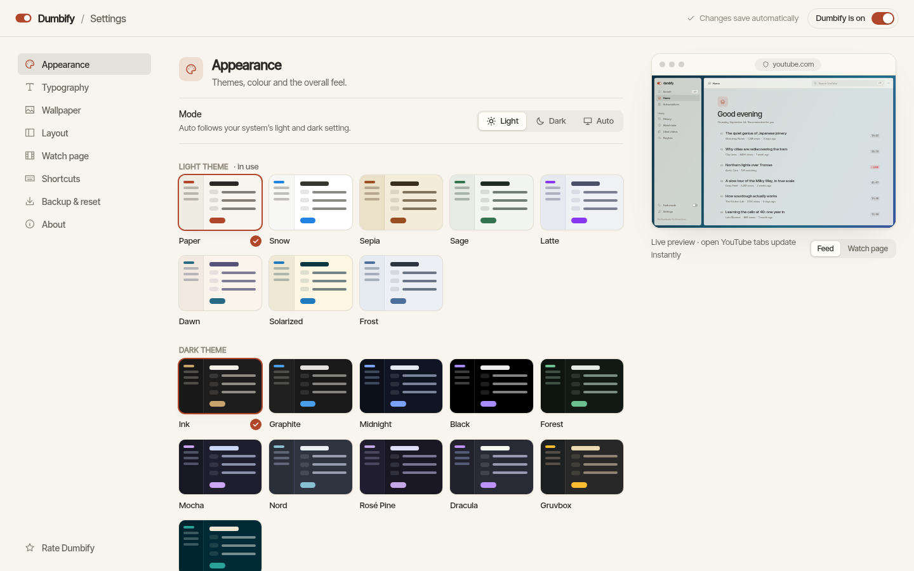

# Dumbify

[](src/manifest.ts)
[](tsconfig.json)
[](LICENSE)

**A calm, text-first YouTube.**

Dumbify is a Chrome extension that reads YouTube's real data and renders it as a plain, readable list — no thumbnails, no autoplay, no recommendation rabbit holes. It sits on top of `youtube.com`, not a separate site: you stay signed in, subscriptions/history/comments all still work, you just stop getting yelled at by the UI.



| Cards over a frosted-glass wallpaper | Table layout, Mocha theme, serif |
| --- | --- |
|  |  |
| **Split watch page** | **Settings, with a live preview** |
|  |  |

## Why

YouTube's UI is built to maximize watch time, not help you find or finish a video. Dumbify strips it back to what a feed actually is: a list of titles, channels, and durations you can scan and pick from.

## Features

- **Text-first feed** — titles, channel, views, and upload date, no thumbnails, across home, search, channel pages, history, subscriptions, and watch later
- **Distraction-free watch page** — title, description, and comments; no autoplay, no end-screen suggestions, no sidebar of "up next"
- **Real interactions, not a read-only mirror** — subscribe/unsubscribe, like, save to playlists, comment and reply, all backed by YouTube's actual API using your signed-in session
- **Keyboard-driven** — `Ctrl/⌘ K` search, `Ctrl/⌘ \` sidebar, `Ctrl/⌘ Shift L` dark mode, `F` full-screen video
- **Infinite scroll** — loads more of the real feed as you go

## Make it yours

Curated rather than endless: every choice below is one that looks right.

- **19 themes** — 8 light (Paper, Snow, Sepia, Sage, Latte, Dawn, Solarized, Frost) and 11 dark (Ink, Graphite, Midnight, Black, Forest, Mocha, Nord, Rosé Pine, Dracula, Gruvbox, Solarized Dark). Pick one for light mode and one for dark, and let **Auto** follow your system. Every theme is tested for WCAG contrast.
- **Accent colour** — the theme's own, nine GNOME-style accents, any custom colour, or one **taken from your wallpaper**.
- **Typography** — Sans, Serif and Mono faces bundled with the extension, plus eight system font styles; text size 12–32px, line spacing, and an optional custom text colour per mode.
- **Layouts** — feeds as a **List**, **Cards** or a dense **Table**; narrow, standard or full page width; a full sidebar, icons only, or hidden; choose which details each video shows. Corners (square, soft, round) and density (compact → spacious).
- **Watch page layouts** — **Classic**, **Theater** (wide video) or **Split** (comments and playlist beside the video).
- **Wallpapers** — upload an image, an **animated GIF**, animated WebP/APNG, or a short **MP4/WebM loop**; drop it anywhere on the settings page or paste it. Or pick a built-in gradient, pattern or slowly moving **Live** wallpaper. Show it behind the whole window or as a Notion-style **page cover**; set the focal point, blur and fade; pause animation (it pauses on its own when your system asks for reduced motion).
- **Panels over the wallpaper** — solid, **frosted glass**, or **clear** (fully transparent), with opacity and a custom tint colour.
- **Quick controls** — a page menu (`•••`) for style, size, layout and width; the toolbar popup for mode, theme, accent, size, font, layout and wallpaper.
- **Backup** — export everything (wallpaper included) to a file and import it elsewhere.

## How it works

Dumbify doesn't scrape the rendered page or replace YouTube's backend. On page load it reads the same `ytInitialData` / `ytInitialPlayerResponse` JSON YouTube itself uses to render, and the same InnerTube API YouTube's own frontend calls for pagination, subscribing, and posting comments. Everything you can do in Dumbify hits YouTube's real endpoints with your real session — there's no shadow account, no separate write path, and no data leaves your browser.

## Install

1. Clone the repo
2. `npm install`
3. `npm run build`
4. Open `chrome://extensions`, enable **Developer Mode**, click **Load unpacked**, and select the `dist/` folder

## Development

```bash
npm run dev        # vite dev, watch mode with HMR
npm run build      # production build to dist/ (reload the unpacked extension after)
npm run typecheck  # src/, plus vite.config.ts and manifest.ts
```

After any change: `npm run build`, then reload the extension from `chrome://extensions` and check the console for `[Dumbify]`-prefixed errors.

### Tests

```bash
npm test                 # unit tests: data extraction, settings + migration, themes, colour, wallpapers, storage
npm run build && npm run test:e2e   # end-to-end: the built extension in headless Chromium
npm run screenshots -- out/          # capture the main screens for review
```

The end-to-end suites load `dist/` into a real Chromium and serve `youtube.com` from local fixtures (`tests/e2e/fixtures.mjs`), so they need no network and no account. They use Playwright's Chromium; install it once with `npx playwright install chromium`.

## Tech stack

TypeScript + Vite (via [`@crxjs/vite-plugin`](https://crxjs.dev/vite-plugin)), Manifest V3, hand-written CSS. No UI framework, no runtime dependencies — plain DOM.

## Project structure

```
src/
  content.ts         content script entry — routes pages to features
  background.ts      service worker — content-script registration, settings migration, page-context data bridging
  core/
    settings.ts      every preference, its default, validation and the v1 → v2 migration
    themes.ts        themes, accents, fonts and built-in wallpapers
    appearance.ts    settings → CSS custom properties and data- attributes
    storage.ts       chrome.storage access, serialized writes, wallpaper storage
    wallpaper.ts     file sniffing and GIF/WebP/APNG animation detection
    backup.ts        export / import
    color.ts         contrast and colour maths
    DataExtractor, FeatureManager, PageManager, UIEngine
  features/
    shell.ts         sidebar, top bar, search, keyboard shortcuts
    view-menu.ts     the in-page ••• menu
    home-feed.ts     home / search / channel / history / subscriptions / watch later / playlists
    watch-page.ts    video player, info, comments, playlist
  ui/                shared DOM helpers, icons, controls and the wallpaper layer
  options/           settings page
  preview/           the settings page's live preview (real reading-view CSS, sample content)
  popup/             toolbar popup
tests/               unit tests (node --test)
tests/e2e/           end-to-end tests (Playwright + fixtures)
```

See `CLAUDE.md` for the full architecture and data-extraction notes.

## License

GPL-3.0 — see [LICENSE](LICENSE).

Theme palettes adapted from [Catppuccin](https://catppuccin.com), [Nord](https://www.nordtheme.com), [Rosé Pine](https://rosepinetheme.com), [Dracula](https://draculatheme.com), [Gruvbox](https://github.com/morhetz/gruvbox) and [Solarized](https://ethanschoonover.com/solarized/), all MIT-licensed. Bundled fonts (Inter Tight, Newsreader, IBM Plex Mono) are under the SIL Open Font License.
