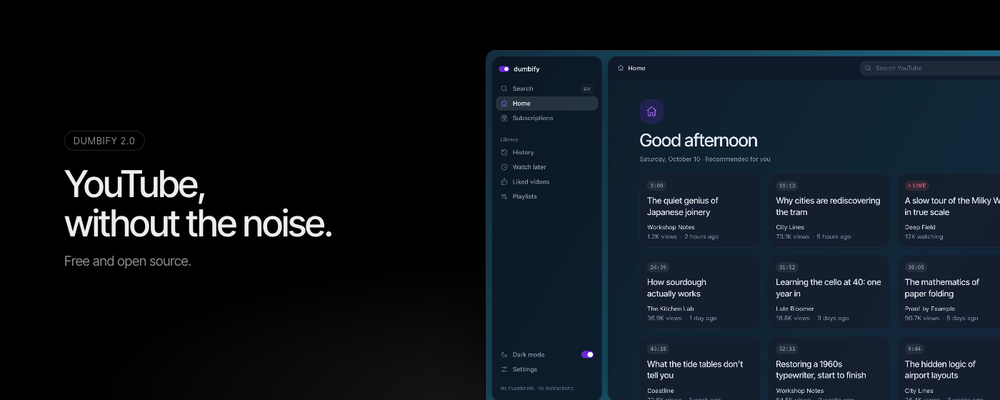
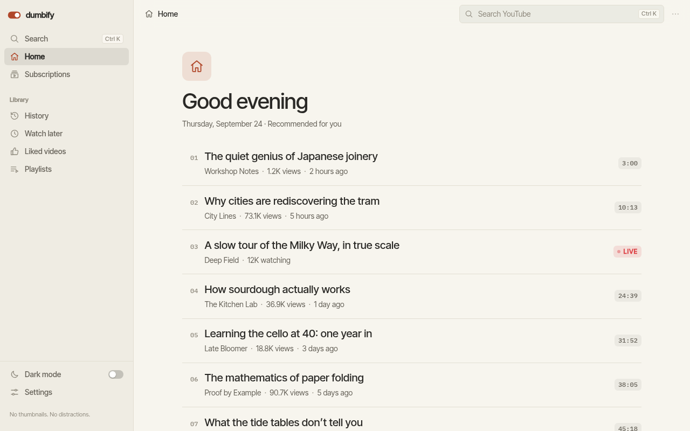
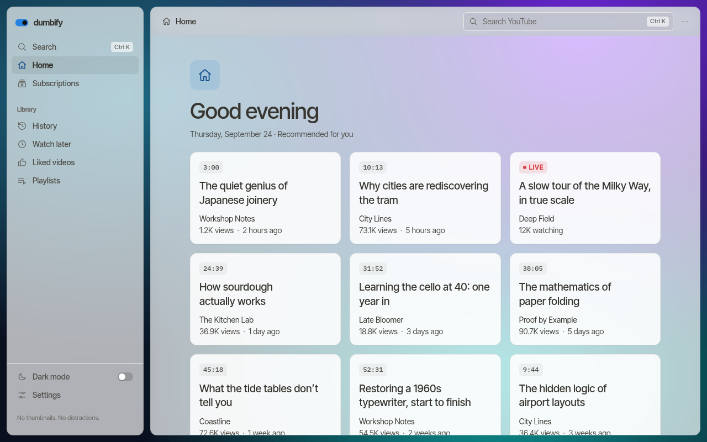
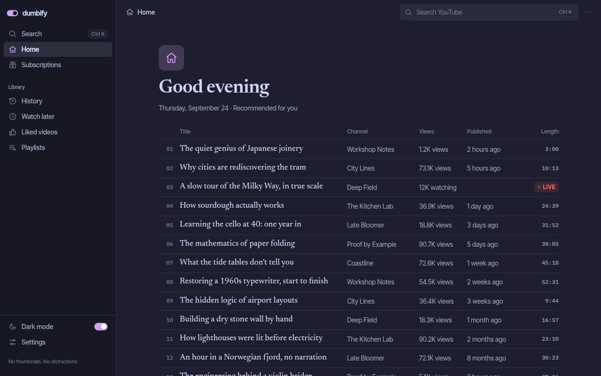
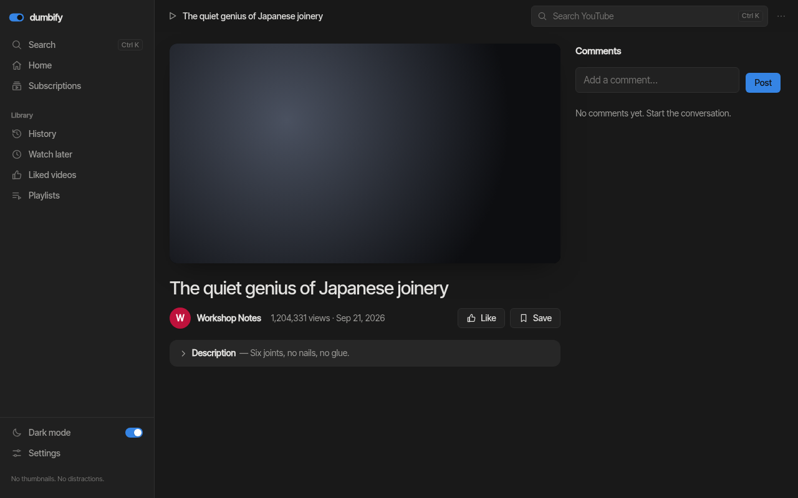
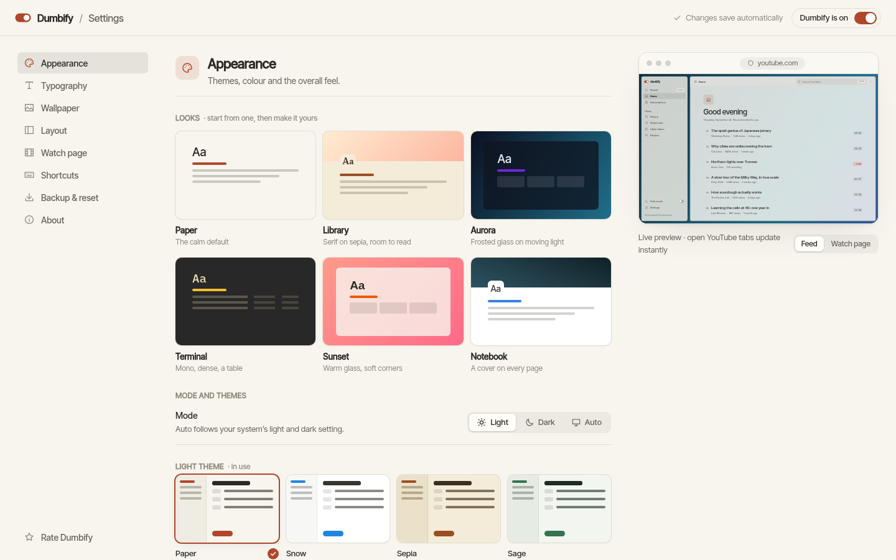

<p align="center">
  
</p>

<p align="center">
  <a href="https://chromewebstore.google.com/detail/dumbify-customizable-text/lhnjjldhbllcdfdldeacdgalkkofhicf"></a>
  <a href="https://addons.mozilla.org/en-US/firefox/addon/dumbify/"></a>
</p>

<p align="center">
  <a href="https://edenrebello.me/dumbify/">Website</a> ·
  <a href="#features">Features</a> ·
  <a href="#contributing">Contributing</a> ·
  <a href="PRIVACY.md">Privacy</a>
</p>

<p align="center">
  
  
  
  <a href="LICENSE"></a>
</p>

---

**Dumbify turns YouTube into a calm reading list.** No thumbnails, no autoplay, no recommendation rabbit holes: just titles, channels and dates you can scan and pick from.

It isn't a separate site. Dumbify sits on top of `youtube.com` and reads YouTube's own data, so you stay signed in and subscriptions, history, likes and comments all still work. You just stop getting yelled at by the UI.



| Cards over a frosted-glass wallpaper | Table layout, Mocha theme, serif |
| --- | --- |
|  |  |
| **Split watch page** | **Settings, with a live preview** |
|  |  |

## Why

YouTube's interface is built to maximize watch time, not to help you find a video and finish it. Dumbify strips it back to what a feed actually is: a list of titles you choose from on purpose.

## Features

### A quieter YouTube

- 📝 **Text-first feeds.** Titles, channel, views and upload date, with no thumbnails, across home, search, channel pages, history, subscriptions and watch later.
- 🎬 **A watch page that stops.** Title, description and comments. No autoplay, no end-screen suggestions, no "up next" sidebar.
- 🔁 **Real, not read-only.** Subscribe, like, save to playlists, comment and reply, all through YouTube's own API with your signed-in session.
- ⌨️ **Keyboard-driven.** `Ctrl/⌘ K` search, `Ctrl/⌘ \` sidebar, `Ctrl/⌘ Shift L` dark mode, `F` full-screen video.
- ♾️ **Infinite scroll** through the real feed.

### Make it yours

Curated rather than endless: every choice is one that looks right.

- 🎨 **Six looks** to start from (Paper, Library, Aurora, Terminal, Sunset, Notebook): theme, type, layout and wallpaper in one click, with Undo.
- 🌗 **19 themes.** 8 light and 11 dark, from Paper and Sepia to Nord, Rosé Pine, Dracula and Gruvbox. Pick one for each mode and let **Auto** follow your system. Every theme is tested for WCAG contrast.
- 🖍️ **Accents:** the theme's own, nine presets, any custom colour, or one taken from your wallpaper.
- 🔤 **Type:** bundled Sans, Serif and Mono faces plus nine system styles; text size 12–32px and line spacing.
- 🧱 **Layouts:** **List**, **Cards** or a dense **Table**; page width, sidebar style, corners and density; choose which details each video shows.
- 📺 **Watch layouts:** **Classic**, **Theater** or **Split** (comments and playlist beside the video).
- 🖼️ **Wallpapers:** your own image, **animated GIF**, WebP/APNG or short **MP4/WebM loop**, or a built-in gradient, pattern or slowly moving **Live** wallpaper. Behind the window or as a page cover, under **solid**, **frosted glass** or **clear** panels, with text that stays readable on whatever it sits on.
- ⚡ **Quick controls** in the toolbar popup and an in-page `•••` menu, and **backup** to move your setup anywhere.

### Private by design

No account, no server, no analytics, no ads. Your settings stay on your device and Dumbify only runs on `youtube.com`. Read the full [privacy policy](PRIVACY.md).

## How it works

Dumbify doesn't scrape the rendered page or replace YouTube's backend. On page load it reads the same `ytInitialData` / `ytInitialPlayerResponse` JSON YouTube itself uses to render, and calls the same InnerTube API YouTube's own frontend calls for pagination, subscribing and posting comments. Everything hits YouTube's real endpoints with your real session: no shadow account, no separate write path, and no data leaves your browser.

Built with TypeScript and Vite (via [`@crxjs/vite-plugin`](https://crxjs.dev/vite-plugin)), Manifest V3 and hand-written CSS. No UI framework and no runtime dependencies, just plain DOM.

## Install from source

```bash
git clone https://github.com/edenreb/dumbify.git
cd dumbify
npm install
npm run build
```

- **Chrome / Edge:** open `chrome://extensions` (or `edge://extensions`), turn on **Developer mode**, click **Load unpacked** and pick `dist/`.
- **Firefox 140+:** run `npm run build:firefox`, open `about:debugging#/runtime/this-firefox`, click **Load Temporary Add-on…** and pick `dist-firefox/manifest.json`. Firefox removes temporary add-ons when it restarts.

## Contributing

Bug reports, ideas and pull requests are all welcome.

1. **Open an issue first** for anything bigger than a small fix, so we can agree on the approach. [Issues →](https://github.com/edenreb/dumbify/issues)
2. **Fork and branch** from `main`.
3. **Make the change**, then check it:

   ```bash
   npm run typecheck                    # src/, plus vite.config.ts and manifest.ts
   npm test                             # unit tests
   npm run build && npm run test:e2e    # the built extension in headless Chromium
   ```

4. **Open a pull request** describing what changed and why, with a screenshot for anything visual.

A few house rules keep Dumbify calm:

- **No runtime dependencies.** Plain DOM and hand-written CSS.
- **Curated over configurable.** A new option should be one that always looks right, not another knob.
- **Readable everywhere.** New themes and colours must pass the contrast tests.
- **Nothing leaves the browser.** No analytics, no remote code, no new servers.

<details>
<summary><b>Development reference</b></summary>

```bash
npm run dev            # vite dev, watch mode with HMR
npm run build          # Chrome build to dist/ (reload the unpacked extension after)
npm run build:firefox  # Firefox build to dist-firefox/
npm run build:edge     # Edge Add-ons build to dist-edge/ (shorter name)
npm run screenshots -- out/   # capture the main screens for review
npm run store:shots    # store listing screenshots and promo tiles, to store/
```

After any change, rebuild, reload the extension and check the console for `[Dumbify]`-prefixed errors.

The end-to-end suites load `dist/` into a real Chromium and serve `youtube.com` from local fixtures (`tests/e2e/fixtures.mjs`), so they need no network and no account. Install Playwright's Chromium once with `npx playwright install chromium`, or point `CHROMIUM_PATH` at another Chromium build.

**Firefox package.** The Firefox build is the same code with a different manifest (`src/manifest.ts` switches on the build mode): an event-page background, a name within addons.mozilla.org's 50 characters, and the add-on ID and data collection declaration Firefox requires. To reproduce the addons.mozilla.org package (built with Node 26.10.0 and npm 11.19.1):

```bash
npm ci
npm run build:firefox                         # the package is the contents of dist-firefox/
npx web-ext lint --source-dir dist-firefox    # Mozilla's validator, the same checks as on upload
```

**Website.** The GitHub Pages site lives in `docs/` (the landing page, `docs/privacy/` and `docs/site/`); Pages serves that folder as it is, so the built parts are committed. Its live demo is the settings page's preview, built from `src/demo`.

```bash
npm run site                          # build the demo into docs/site/demo, after any change to src/
npm run site:privacy                  # rebuild docs/privacy/ after editing PRIVACY.md
npm run build && npm run site:shots   # re-take docs/site/shots
```

To try it locally, serve `docs/` (`python3 -m http.server -d docs`): the demo talks to the page with `postMessage`, which needs a real origin rather than `file://`.

</details>

<details>
<summary><b>Project structure</b></summary>

```
src/
  content.ts         content script entry: routes pages to features
  background.ts      service worker: content-script registration, settings migration, page-context data bridging
  core/
    settings.ts      every preference, its default, validation and the v1 → v2 migration
    themes.ts        themes, accents, fonts and built-in wallpapers
    appearance.ts    settings → CSS custom properties and data- attributes, readable text on any panel
    looks.ts         the curated one-click looks
    storage.ts       chrome.storage access, serialized writes, the uploads gallery
    wallpaper.ts     file sniffing, GIF/WebP/APNG animation detection, upload summaries
    analyze.ts       thumbnails and colours for an upload (no DOM, so the service worker can run it)
    backup.ts        export / import
    color.ts         contrast and colour maths
    DataExtractor, FeatureManager, PageManager, UIEngine
  features/
    shell.ts         sidebar, top bar, search, keyboard shortcuts
    view-menu.ts     the in-page ••• menu
    home-feed.ts     home / search / channel / history / subscriptions / watch later / playlists
    watch-page.ts    video player, info, comments, playlist
  ui/                shared DOM helpers, icons, controls, store links and the wallpaper layer
  options/           settings page
  preview/           the settings page's live preview (real reading-view CSS, sample content)
  demo/              the website's live demo: the preview, driven by the page around it
  popup/             toolbar popup
  public/            static files copied into the build: icons and bundled fonts
tests/               unit tests (node --test)
tests/e2e/           end-to-end tests (Playwright + fixtures)
docs/                the website (GitHub Pages): landing page, privacy page, demo build
assets/              brand artwork and the README's images
```

</details>

## License

Dumbify is free and open source under the [GNU General Public License v3.0](LICENSE). You can use, study, share and change it; if you distribute a modified version, it must stay open under the same license.

Theme palettes adapted from [Catppuccin](https://catppuccin.com), [Nord](https://www.nordtheme.com), [Rosé Pine](https://rosepinetheme.com), [Dracula](https://draculatheme.com), [Gruvbox](https://github.com/morhetz/gruvbox) and [Solarized](https://ethanschoonover.com/solarized/), all MIT-licensed. Bundled fonts (Inter Tight, Newsreader, IBM Plex Mono) are under the SIL Open Font License.

<p align="center"><sub>Made by Eden Rebello and Gabriel Tan.</sub></p>
